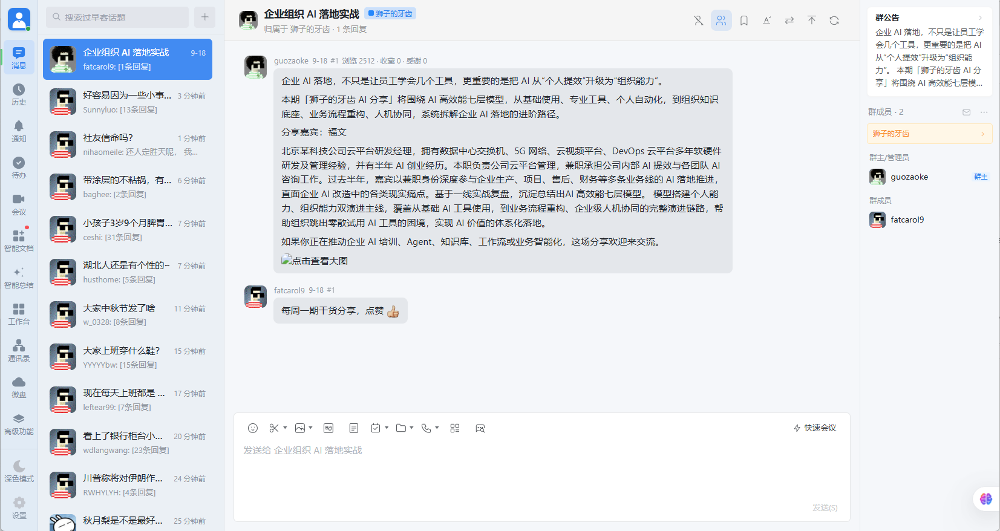

# 过早客企业微信主题

把 [过早客](https://www.guozaoke.com/) 深度定制为**企业微信 5.x 桌面端**现代 IM 风格。在保留原站真实数据、动态路由、通知系统、交互逻辑与账号功能的同时，提供沉浸且逼真的办公摸鱼体验。

## 来源与适配

当前项目来自 [samsamsue/wecom_v2linuxdo](https://github.com/samsamsue/wecom_v2linuxdo)（Linux.do & V2EX 企业微信主题），并在此基础上适配 [guozaoke.com](https://www.guozaoke.com/)。

- 当前仓库：[DevSparkBox/wecom_guozaoke](https://github.com/DevSparkBox/wecom_guozaoke)
- 远程地址：`git@github.com:DevSparkBox/wecom_guozaoke.git`
- 上游仓库：https://github.com/samsamsue/wecom_v2linuxdo
- 当前适配站点：[过早客 / guozaoke.com](https://www.guozaoke.com/)
- 上游作者：**Richy**
- 当前版本：**0.1.0**
- 用户脚本：[`guozaoke-wecom.user.js`](guozaoke-wecom.user.js)
- 脚本元数据：[`guozaoke-wecom.meta.js`](guozaoke-wecom.meta.js)
- 许可证：MIT

> 本仓库保留上游企业微信 5.x 交互骨架，按过早客页面结构做站点适配；Linux.do 专属能力（如 Connect 面板）默认不启用。

---

## 效果预览

全新企业微信 5.x 现代布局，完整重构左侧主导航栏、会话列表栏、右侧聊天窗口与沉浸式底部输入框：



---

## 核心特性

### 1. 经典企业微信 5.x 桌面端像素级还原
- **三栏式标准布局**：深色/浅色左侧图标导航栏、中间会话列表栏与右侧消息详情/输入栏。
- **消息气泡与头像**：本人消息浅蓝气泡居右、他人消息白灰气泡居左；支持一键开启**伪装头像模式**（自动转换为单字头像或九宫格群头像），防窥更安全。
- **相对时间动态刷新**：会话列表与聊天气泡的时间标签（刚刚、5分钟前）后台实时自动更新，无需手动刷新网页。
- **深浅色无缝适配**：支持浅色模式、深色模式与跟随系统自动切换。

### 2. 过早客站点适配
- 脚本仅匹配 `guozaoke.com` / `*.guozaoke.com`，打开过早客后自动切换为企业微信界面。
- 沿用上游 V2EX 风格的会话流、楼层回复、节点导航与本地设置，按过早客页面结构完成适配。
- **对话楼层关系（树状会话层级视图）**：可在设置中开启/关闭（快捷键 Alt+T），依据回帖开头的 @author 与 #floor 建立时序分支树。
- **无感后台轮询与滚动锁定**：浏览帖子详情时，后台静默轮询新回复并自动追加；阅读中尽量避免滚动条跳动。
- **成员名片卡与快捷操作**：点击成员头像可弹出名片卡，支持关注、屏蔽与查看最近回复等原站能力。
- **Imgur 图床上传**：发帖或回复时，可通过图片按钮、粘贴截图或拖拽图片上传，并将直链插入编辑框。

### 3. 摸鱼神器与效率小工具
- **快捷键瞬间穿梭**：按下 **Alt + W** 或 **Alt + O** 即可在企业微信 IM 视图与原站原版网页之间切换。
- **划词 Base64 快速解码**：页面中划选 Base64 字符串时，自动浮现解码卡片。
- **自定义背景水印**：支持自定义聊天窗口背景水印文字与开关，设置仅保存在本地浏览器中。
- **图片灯箱预览**：聊天流中的图片点击即可打开全屏灯箱，支持滚轮缩放与拖拽查看。

---

## 快速安装

1. 首先安装浏览器脚本管理器：
   - 推荐使用 [Tampermonkey (篡改猴)](https://www.tampermonkey.net/) 或 [Violentmonkey (暴力猴)](https://violentmonkey.github.io/)。
2. 点击下方链接一键安装用户脚本：
   - **[安装用户脚本 (Raw)](https://github.com/DevSparkBox/wecom_guozaoke/raw/main/guozaoke-wecom.user.js)**
3. 脚本管理器弹出安装界面后，点击安装或更新即可。
4. 安装完成后，打开 [过早客](https://www.guozaoke.com/) 即可自动呈现企业微信界面。

```text
当前仓库：
https://github.com/DevSparkBox/wecom_guozaoke

克隆地址：
git@github.com:DevSparkBox/wecom_guozaoke.git

脚本安装直链：
https://github.com/DevSparkBox/wecom_guozaoke/raw/main/guozaoke-wecom.user.js
```

上游原项目（Linux.do & V2EX 版本）见：

https://github.com/samsamsue/wecom_v2linuxdo

---

## 自动更新机制

- **脚本管理器自动更新**：配置有轻量级的 @updateURL（[`guozaoke-wecom.meta.js`](guozaoke-wecom.meta.js)），管理器会在后台定期比对版本并更新。
- **内置新版静默探测**：进入页面后在后台比对版本，发现新版时可在界面右下角提醒并跳转确认。

---

## 操作与快捷键速查表

| 按键 / 操作区域 | 功能说明 |
| :--- | :--- |
| **Alt + W** / **Alt + O** | 随时切换企业微信主题与原站原生网页视图 |
| **左侧个人头像** | 打开通知中心、个人设置与快捷菜单 |
| **会话列表顶部+** | 展开或收起板块、分类与节点树 |
| **会话列表顶部搜索框** | 实时搜索原站帖子与话题 |
| **伪装头像切换按钮** | 切换真实头像 / 单字头像 / 九宫格头像伪装 |
| **消息气泡悬浮工具栏** | 点赞、回复、楼层书签收藏、编辑本人消息 |
| **被回复楼层引用框** | 显示被引用消息摘要，点击直接跳转至该楼层 |
| **聊天标题栏水印** | 打开聊天背景水印设置，可自定义文字 |
| **聊天标题栏原生外链** | 快速切回原生网页视图 |
| **底部输入区** | Enter 发送消息，Shift + Enter 换行；支持粘贴/拖拽截图 |
| **聊天图片点击** | 开启图片大图灯箱预览，支持滚轮缩放 |

---

## 项目结构

```text
wecom_guozaoke/
├─ guozaoke-wecom.user.js   # 过早客适配后的核心用户脚本
├─ guozaoke-wecom.meta.js   # 轻量级元数据文件（用于脚本管理器自动更新）
├─ snapshot/
│  └─ 1.png                 # 主界面预览截图
├─ README.md                # 项目说明
└─ LICENSE                  # MIT 开源许可证
```

---

## 声明

本项目基于 [samsamsue/wecom_v2linuxdo](https://github.com/samsamsue/wecom_v2linuxdo) 适配 [过早客](https://www.guozaoke.com/)，仅做前端样式定制与交互增强，不提供企业微信服务，亦不隶属于或代表腾讯公司、企业微信或过早客官方。所有数据交互均直接发生于用户本地浏览器与 `guozaoke.com` 之间。

## License

MIT License © 2026 Richy
